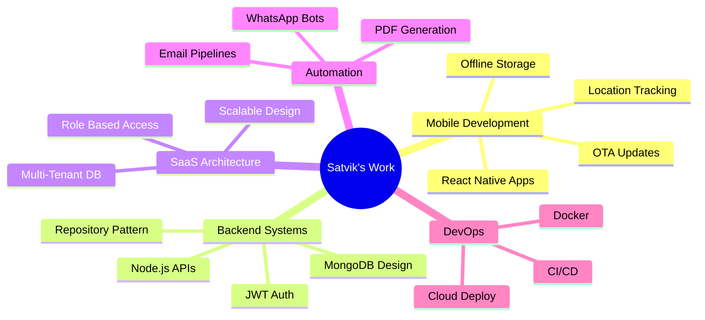

<h1 align="center">
  
</h1>

<h3 align="center">
Software Developer @ Medispace Solutions
</h3>

Full-Stack Engineering &nbsp;•&nbsp; Mobile Development &nbsp;•&nbsp; SaaS Architecture &nbsp;•&nbsp; Cloud Infrastructure

  

---

 

## 🚀 About Me

I'm currently working as a `Software Developer` at `Medispace Solutions`, architecting a complete `Multi-Tenant SaaS platform` from the ground up—handling everything from database schema design to full-stack implementation and cloud infrastructure.

My work primarily focuses on building highly scalable, cross-platform solutions. I develop native-feeling mobile apps using `React Native` (incorporating complex device features), robust web dashboards using `Next.js`, and highly optimized, service-oriented backend architectures.

I thrive on solving complex engineering challenges, such as implementing `Android Foreground Location Tracking`, building `Automated WhatsApp Bots`, integrating `Over-The-Air (OTA)` mobile updates, and designing secure data pipelines.

 

## 🎯 What I Work On

- `Enterprise Mobile Development` (Custom OTA updates, offline-first encrypted storage)
- `Advanced Geolocation` (Native Android foreground services, battery-optimized tracking)
- `SaaS Architecture` (Multi-Tenant Database design using MongoDB and Node.js)
- `Automated Document Pipelines` (Server-side PDF Generation engines using Puppeteer)
- `Third-Party Integrations` (Interactive WhatsApp Chatbots, Twilio/ZeptoMail notifications)
- `Clean Backend Systems` (Repository Pattern, JWT role-based guards, Prometheus metrics)
- `Production Infrastructure` (Scalable deployments and CI/CD across Linode and Vercel)

 

## 💼 Professional Experience

<table>
<tr>
<td width="50%">

### 🏢 Software Developer
**Medispace Solutions** • *May 2025 – Present*

- 🏗️ Architecting **Multi-Tenant SaaS** from ground up
- 📱 Built **React Native** app with native features
- ⚡ Implemented **OTA updates** & offline storage
- 🤖 Integrated **WhatsApp Chatbots** for automation
- 📊 Added **Prometheus** observability
- 🚀 Deployed on **Linode** & **Vercel**

</td>
<td width="50%">

### 💻 Full Stack Developer Intern
**Techniajz** • *Oct 2024 – Mar 2025*

- 🔧 Built backend with **Node.js** & **Express**
- 🎨 Developed UIs with **React** & **Angular**
- ⚡ Added real-time features via **Socket.io**
- 🗄️ Optimized multi-tenant database operations
- 🔐 Implemented authentication systems

</td>
</tr>
</table>

 

## 🛠️ Tech Stack

### Languages

### Frontend & Mobile

### Backend & Database

### DevOps & Tools

 

## 📊 GitHub Analytics

 

## 🏆 GitHub Trophies

  

 

## 🐍 Contribution Graph

  

 

## 💡 Technical Expertise

 

---

### 💬 Let's Connect & Build Something Amazing!

*Open to collaborations, freelance projects, and interesting conversations about tech*

 

&nbsp;

&nbsp;

&nbsp;

  

